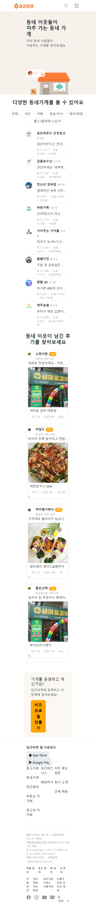

    
 반응형 페이지 스크린샷 

    

    

        

            
메인 페이지 화면 - 230403

            

                
PC 화면

                
                
태블릿 화면

                
                
핸드폰 화면

                
            

        

        

            
동네가게 페이지 화면 - 230403

            

                
PC 화면

                
                
태블릿 화면

                
                
핸드폰 화면

                
            

        

        

            
알바 화면 - 230403

            

                
PC 화면

                
                
핸드폰 화면

                
            

        

        

        
부동산 직거래 화면 - 230403

            

                
PC 화면

                
                
핸드폰 화면

                
            

        

        

            
중고차 직거래 화면 - 230403

            

                
PC 화면

                
                
핸드폰 화면

                
            

        

    

    

---

## 0403 당근마켓 클론코딩 회고

* 사이즈를 줄이면 양옆에 여백이 남는 것이 문제다. 아마도 w-50으로 맞춰서 그런 것 같다.
PC일때의 section 내 div의 크기를 고정하고, min-width를 설정하면 될 것 같다.

* 버튼 사이즈 고정과 nav 부분의 공간 구분이 아직 미흡하다.